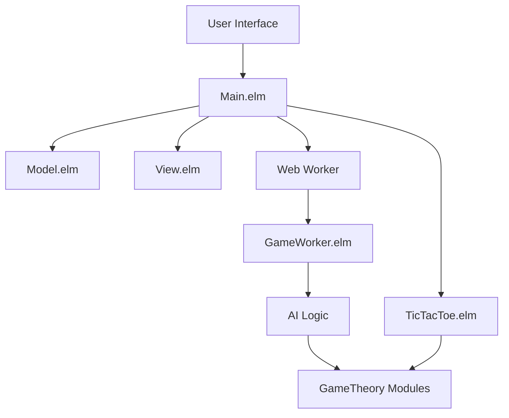
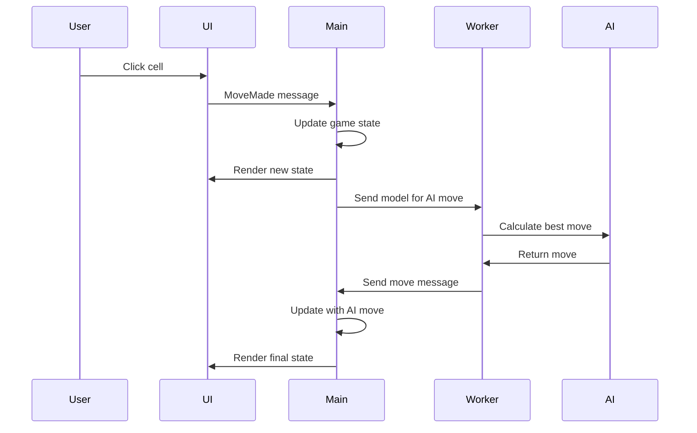

# Design Document

## Overview

The tic-tac-toe game is built using Elm's functional architecture with a clean separation of concerns. The application follows the Model-View-Update (MVU) pattern and leverages web workers for AI computations to maintain UI responsiveness. The design emphasizes immutability, type safety, and functional programming principles while providing an engaging user experience.

## Architecture

### High-Level Architecture



### Core Modules

1. **Main.elm** - Application entry point, handles initialization, updates, and subscriptions
2. **Model.elm** - Defines all data types, game state, and JSON encoding/decoding
3. **View.elm** - Renders the UI using elm-ui with SVG graphics for game pieces
4. **TicTacToe/TicTacToe.elm** - Core game logic, move validation, and win detection
5. **GameWorker.elm** - Web worker for AI computations
6. **GameTheory/AdversarialEager.elm** - Minimax and negamax algorithms for AI decision making

### Data Flow



## Components and Interfaces

### Core Data Types

```elm
type Player = X | O

type GameState
    = Waiting Player
    | Thinking Player
    | Winner Player
    | Draw
    | Error String

type alias Position = { row : Int, col : Int }

type alias Board = List (List (Maybe Player))

type alias Model =
    { board : Board
    , gameState : GameState
    , lastMove : Maybe Time.Posix
    , now : Maybe Time.Posix
    , colorScheme : ColorScheme
    , maybeWindow : Maybe ( Int, Int )
    }
```

### Message Types

```elm
type Msg
    = MoveMade Position
    | ResetGame
    | GameError String
    | ColorScheme ColorScheme
    | GetViewPort Browser.Dom.Viewport
    | GetResize Int Int
    | Tick Time.Posix
```

### Game Logic Interface

The `TicTacToe.TicTacToe` module provides the core game functionality:

- **Move Validation**: `makeMove : Player -> Board -> Position -> Board`
- **Win Detection**: `checkWinner : Board -> Maybe GameWon`
- **AI Decision Making**: `findBestMove : Player -> Board -> Maybe Position`
- **Board Scoring**: `scoreBoard : Player -> Board -> Int`

### AI Algorithm Interface

The AI uses the negamax algorithm with the following signature:
```elm
negamax : 
    (player -> node -> List move) -> 
    (player -> node -> move -> node) -> 
    (player -> node -> number) -> 
    (node -> Bool) -> 
    (player -> player) -> 
    Int -> 
    player -> 
    node -> 
    Maybe move
```

### Web Worker Communication

Communication between main thread and worker uses JSON encoding:

**Main → Worker**: Encoded Model
```elm
encodeModel : Model -> Encode.Value
```

**Worker → Main**: Encoded Message
```elm
encodeMsg : Msg -> Encode.Value
```

## Data Models

### Game Board Representation

The board is represented as a 3x3 grid using nested lists:
```elm
type alias Board = List (List (Maybe Player))

-- Example empty board:
[ [ Nothing, Nothing, Nothing ]
, [ Nothing, Nothing, Nothing ]
, [ Nothing, Nothing, Nothing ]
]
```

### Game State Management

Game states follow a clear progression:
- `Waiting Player` - Waiting for human or AI player input
- `Thinking Player` - AI is calculating next move
- `Winner Player` - Game ended with a winner
- `Draw` - Game ended in a tie
- `Error String` - Error state with message

### Timeout Handling

The system tracks move timing to implement auto-play:
- `lastMove : Maybe Time.Posix` - Timestamp of last move
- `now : Maybe Time.Posix` - Current time for calculations
- `idleTimeoutMillis : Int` - 5000ms timeout threshold

## Error Handling

### Error Categories

1. **Game Logic Errors**
   - Invalid moves (occupied cells)
   - Moves after game end
   - Malformed positions

2. **Communication Errors**
   - JSON encoding/decoding failures
   - Worker communication issues
   - Port message failures

3. **AI Computation Errors**
   - No valid moves found
   - Algorithm failures
   - Timeout issues

### Error Recovery

- All errors are captured in the `Error` game state
- Error messages are displayed to the user
- Reset functionality allows recovery from any error state
- Graceful degradation when worker fails

## Testing Strategy

### Unit Testing Approach

1. **Game Logic Testing**
   - Win condition detection for all scenarios
   - Move validation edge cases
   - Board state transitions
   - AI move quality verification

2. **Model Testing**
   - JSON encoding/decoding round trips
   - State transition validation
   - Message handling correctness

3. **Integration Testing**
   - Full game flow scenarios
   - Worker communication
   - UI interaction flows

### Test Structure

Tests are organized in the `tests/` directory:
- `TicTacToe/TicTacToeTest.elm` - Core game logic tests
- `GameTheory/AdversarialEagerTest.elm` - AI algorithm tests
- Integration tests for complete game scenarios

### Property-Based Testing

Key properties to test:
- Game always ends in finite moves
- AI never makes invalid moves
- Board state consistency after operations
- JSON serialization preserves data integrity

## Performance Considerations

### Web Worker Benefits

- AI calculations run on separate thread
- UI remains responsive during AI thinking
- No blocking of user interactions
- Scalable for more complex AI algorithms

### Optimization Strategies

1. **Algorithm Efficiency**
   - Negamax with alpha-beta pruning available
   - Configurable search depth (currently 9 for complete search)
   - Early termination for obvious moves

2. **Memory Management**
   - Immutable data structures prevent memory leaks
   - Elm's garbage collection handles cleanup
   - Minimal state retention between games

3. **Rendering Optimization**
   - SVG-based pieces for crisp scaling
   - Efficient elm-ui layout system
   - Responsive design adapts to viewport

## Accessibility and Usability

### Visual Design

- High contrast color schemes (light/dark themes)
- Clear visual feedback for game states
- Scalable SVG graphics for all screen sizes
- Touch-friendly cell sizes for mobile devices

### User Experience

- Immediate visual feedback for moves
- Clear status messages for all game states
- Countdown timer for idle timeout
- One-click game reset functionality
- Persistent theme preference

### Responsive Design

- Viewport-aware layout adjustments
- Window resize handling
- Mobile-optimized touch targets
- Consistent experience across devices