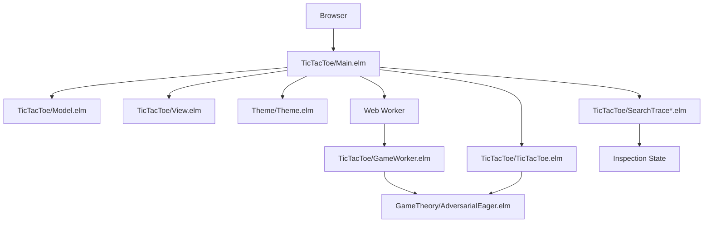
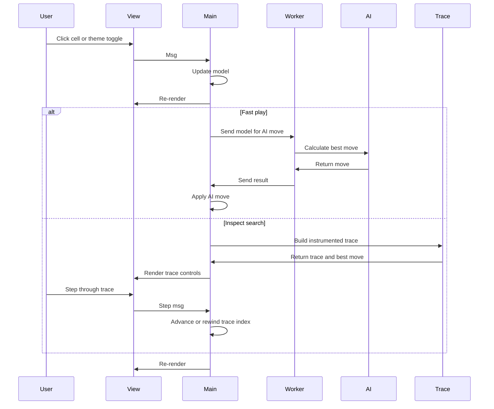

# Design Document

## Overview

The tic-tac-toe application is a single-screen Elm program that boots directly into the game. `TicTacToe.Main` is the application entry point, there is no routing layer or app shell, and the UI is rendered with `elm-ui`. The game uses a shared theme module for color scheme state, responsive sizing, and persistence, while web workers keep the normal AI move path off the main thread. A separate inspection path can instrument Negamax or Alpha-Beta search so the user can step through the evaluation tree without changing the fast gameplay path.

## Architecture

### High-Level Architecture



### Core Modules

1. **TicTacToe/Main.elm** - Application entry point, handles initialization, updates, subscriptions, worker wiring, theme persistence, and inspection-mode coordination
2. **TicTacToe/Model.elm** - Defines the game model, board state, search-inspection state, status state, viewport state, and serialized theme preference
3. **TicTacToe/View.elm** - Renders the responsive single-screen game interface and the search inspection controls with `elm-ui`
4. **TicTacToe/TicTacToe.elm** - Core game logic, move validation, win detection, and round progression
5. **TicTacToe/GameWorker.elm** - Web worker for fast-play AI computations
6. **TicTacToe/SearchTrace*.elm** - Pure trace generation for instrumented Negamax and Alpha-Beta inspection
7. **GameTheory/AdversarialEager.elm** - Negamax-based fast-play AI decision making
8. **Theme/Theme.elm** - Shared color scheme, theme selection, responsive sizing, and JSON encoding/decoding

### Data Flow



## Components and Interfaces

### Core Data Types

```elm
type Player
    = X
    | O

type GameState
    = Waiting Player
    | Thinking Player
    | Winner Player
    | Draw
    | Error String

type alias Position =
    { row : Int
    , col : Int
    }

type alias Board =
    List (List (Maybe Player))

type alias Model =
    { board : Board
    , gameState : GameState
    , lastMove : Maybe Time.Posix
    , now : Maybe Time.Posix
    , colorScheme : ColorScheme
    , maybeWindow : Maybe ( Int, Int )
    , maybeSearchInspection : Maybe SearchInspectionState
    }

type SearchAlgorithm
    = Negamax
    | AlphaBeta

type NodeStatus
    = Unvisited
    | Active
    | Expanded
    | Finalized
    | Pruned

type alias SearchNodeId =
    Int

type alias SearchNode =
    { id : SearchNodeId
    , board : Board
    , player : Player
    , depth : Int
    , moveFromParent : Maybe Position
    , score : Maybe Int
    , alpha : Maybe Int
    , beta : Maybe Int
    , status : NodeStatus
    , children : List SearchNodeId
    }

type SearchEvent
    = EnteredNode SearchNodeId
    | ConsideredMove SearchNodeId Position
    | LeafEvaluated SearchNodeId Int
    | PropagatedScore SearchNodeId Int
    | AlphaUpdated SearchNodeId Int
    | BetaUpdated SearchNodeId Int
    | PrunedBranch SearchNodeId
    | FinalizedNode SearchNodeId

type alias SearchTrace =
    { algorithm : SearchAlgorithm
    , rootNodeId : SearchNodeId
    , nodes : Dict SearchNodeId SearchNode
    , events : List SearchEvent
    , bestMove : Maybe Position
    }

type alias SearchInspectionState =
    { trace : SearchTrace
    , eventIndex : Int
    , committed : Bool
    }
```

### Message Types

```elm
type Msg
    = MoveMade Position
    | ResetGame
    | GameError String
    | ColorSchemeChanged ColorScheme
    | GotViewport Browser.Dom.Viewport
    | GotResize Int Int
    | Tick Time.Posix
    | StartInspection SearchAlgorithm
    | StepInspectionBack
    | StepInspectionForward
    | ApplyInspectionMove
    | AutoPlayComputerMove
```

### Game Logic Interface

The `TicTacToe.TicTacToe` module provides the core game behavior:

- `makeMove : Player -> Board -> Position -> Board`
- `checkWinner : Board -> Maybe GameWon`
- `findBestMove : Player -> Board -> Maybe Position`
- `scoreBoard : Player -> Board -> Int`

The instrumented search trace layer provides a separate pure API for teaching and inspection:

- `buildSearchTrace : SearchAlgorithm -> Board -> Player -> SearchTrace`
- `stepTraceForward : SearchTrace -> Int -> SearchInspectionState`
- `stepTraceBackward : SearchTrace -> Int -> SearchInspectionState`
- `currentInspectionSnapshot : SearchInspectionState -> { node : Maybe SearchNode, event : Maybe SearchEvent }`

### Web Worker Communication

Communication between the main thread and the worker uses JSON encoding:

**Main -> Worker**: Encoded model for fast play only
```elm
encodeModel : Model -> Encode.Value
```

**Inspection path**: Pure trace data
```elm
buildSearchTrace : SearchAlgorithm -> Board -> Player -> SearchTrace
```

## Data Models

### Game Board Representation

The board is represented as a 3x3 grid using nested lists:

```elm
type alias Board =
    List (List (Maybe Player))
```

### Game State Management

Game states follow a clear progression:

- `Waiting Player` - Waiting for human or AI input
- `Thinking Player` - AI is calculating the next move
- `Inspecting SearchAlgorithm` - Search trace is available for stepping and review
- `Winner Player` - Game ended with a winner
- `Draw` - Game ended in a tie
- `Error String` - Error state with message

### Timeout Handling

The system tracks move timing to implement auto-play:

- `lastMove : Maybe Time.Posix` - Timestamp of the last move
- `now : Maybe Time.Posix` - Current time for calculations
- `idleTimeoutMillis : Int` - 5000ms timeout threshold

## Error Handling

### Error Categories

1. **Game Logic Errors**
   - Invalid moves on occupied cells
   - Moves after game end
   - Malformed positions

2. **Inspection Errors**
   - Trace generation failures
   - Invalid step indices
   - Attempting to apply a move before the trace has been inspected

3. **Communication Errors**
   - JSON encoding and decoding failures
   - Worker communication issues
   - Port message failures

4. **AI Computation Errors**
   - No valid moves found
   - Algorithm failures
   - Timeout issues

### Error Recovery

- Errors are represented in the `Error` game state
- Error messages are displayed to the player
- Reset functionality allows recovery from any error state
- Worker failure degrades gracefully without blocking the interface
- Inspection mode can always fall back to the normal fast-play path

## Testing Strategy

### Unit Testing Approach

1. **Game Logic Testing**
   - Win condition detection for all scenarios
   - Move validation edge cases
   - Board state transitions
   - AI move quality verification
   - Trace generation for Negamax and Alpha-Beta
   - Stepping forward and backward through trace events
   - Alpha/beta bound updates and pruning metadata

2. **Model Testing**
   - JSON encoding and decoding round trips
   - State transition validation
   - Message handling correctness

3. **Integration Testing**
   - Full game flow scenarios
   - Worker communication
   - UI interaction flows
   - Inspection mode workflows
   - Applying the final move from an inspected trace

### Test Structure

Tests are organized in the `tests/` directory:

- `tests/TicTacToe/TicTacToeUnitTest.elm` - Core game logic tests
- `tests/GameTheory/AdversarialEagerUnitTest.elm` - AI algorithm tests
- `tests/TicTacToe/TicTacToeIntegrationTest.elm` - Integration tests for complete game scenarios
- `tests/TicTacToe/ViewUnitTest.elm` - UI rendering tests
- `tests/TicTacToe/ModelUnitTest.elm` - Model and transition tests

### Property-Based Testing

Key properties to test:

- The game always ends in a finite number of moves
- AI never makes invalid moves
- Board state remains consistent after operations
- JSON serialization preserves data integrity

## Performance Considerations

### Web Worker Benefits

- AI calculations run on a separate thread
- UI remains responsive during AI thinking
- User interactions are never blocked by move search
- The implementation stays scalable for future AI improvements
- Instrumented inspection uses a separate pure trace path so the fast-play worker path stays unchanged

### Optimization Strategies

1. **Algorithm Efficiency**
   - Negamax search with pruning support for fast play
   - Early termination for obvious moves
   - Minimal recomputation between turns
   - Deterministic trace generation for teaching and inspection

2. **Memory Management**
   - Immutable data structures prevent memory leaks
   - Elm's garbage collector handles cleanup
   - Minimal state retention between rounds

3. **Rendering Optimization**
   - SVG-based pieces for crisp scaling
   - Efficient `elm-ui` layout composition
   - Responsive layout adapts to viewport changes
   - Inspection controls and trace panel remain legible on mobile and desktop

## Accessibility and Usability

- High-contrast color schemes for light and dark themes
- Clear visual feedback for game states
- Scalable graphics for all screen sizes
- Touch-friendly cell sizes on mobile devices
- Persistent theme preference across reloads
- Pruned branches and active nodes are visually distinct in Alpha-Beta inspection
