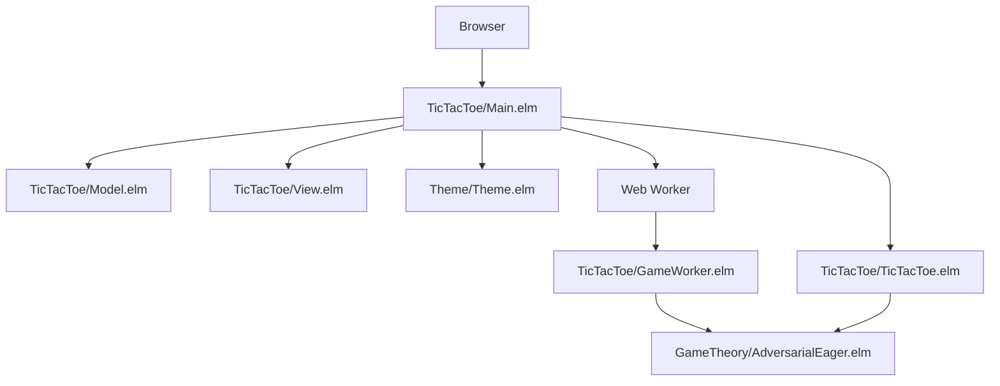
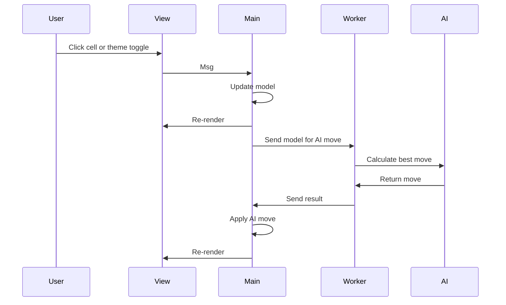

# Design Document

## Overview

The tic-tac-toe application is a single-screen Elm program that boots directly into the game. `TicTacToe.Main` is the application entry point, there is no routing layer or app shell, and the UI is rendered with `elm-ui`. The game uses a shared theme module for color scheme state, responsive sizing, and persistence, while web workers keep AI computations off the main thread.

## Architecture

### High-Level Architecture



### Core Modules

1. **TicTacToe/Main.elm** - Application entry point, handles initialization, updates, subscriptions, worker wiring, and theme persistence
2. **TicTacToe/Model.elm** - Defines the game model, board state, status state, viewport state, and serialized theme preference
3. **TicTacToe/View.elm** - Renders the responsive single-screen game interface with `elm-ui`
4. **TicTacToe/TicTacToe.elm** - Core game logic, move validation, win detection, and round progression
5. **TicTacToe/GameWorker.elm** - Web worker for AI computations
6. **GameTheory/AdversarialEager.elm** - Negamax-based AI decision making
7. **Theme/Theme.elm** - Shared color scheme, theme selection, responsive sizing, and JSON encoding/decoding

### Data Flow



## Components and Interfaces

### Core Data Types

```elm
type Player
    = X
    | O

type GameState
    = Waiting Player
    | Thinking Player
    | Winner Player
    | Draw
    | Error String

type alias Position =
    { row : Int
    , col : Int
    }

type alias Board =
    List (List (Maybe Player))

type alias Model =
    { board : Board
    , gameState : GameState
    , lastMove : Maybe Time.Posix
    , now : Maybe Time.Posix
    , colorScheme : ColorScheme
    , maybeWindow : Maybe ( Int, Int )
    }
```

### Message Types

```elm
type Msg
    = MoveMade Position
    | ResetGame
    | GameError String
    | ColorSchemeChanged ColorScheme
    | GotViewport Browser.Dom.Viewport
    | GotResize Int Int
    | Tick Time.Posix
```

### Game Logic Interface

The `TicTacToe.TicTacToe` module provides the core game behavior:

- `makeMove : Player -> Board -> Position -> Board`
- `checkWinner : Board -> Maybe GameWon`
- `findBestMove : Player -> Board -> Maybe Position`
- `scoreBoard : Player -> Board -> Int`

### Web Worker Communication

Communication between the main thread and the worker uses JSON encoding:

**Main -> Worker**: Encoded model
```elm
encodeModel : Model -> Encode.Value
```

**Worker -> Main**: Encoded message
```elm
encodeMsg : Msg -> Encode.Value
```

## Data Models

### Game Board Representation

The board is represented as a 3x3 grid using nested lists:

```elm
type alias Board =
    List (List (Maybe Player))
```

### Game State Management

Game states follow a clear progression:

- `Waiting Player` - Waiting for human or AI input
- `Thinking Player` - AI is calculating the next move
- `Winner Player` - Game ended with a winner
- `Draw` - Game ended in a tie
- `Error String` - Error state with message

### Timeout Handling

The system tracks move timing to implement auto-play:

- `lastMove : Maybe Time.Posix` - Timestamp of the last move
- `now : Maybe Time.Posix` - Current time for calculations
- `idleTimeoutMillis : Int` - 5000ms timeout threshold

## Error Handling

### Error Categories

1. **Game Logic Errors**
   - Invalid moves on occupied cells
   - Moves after game end
   - Malformed positions

2. **Communication Errors**
   - JSON encoding and decoding failures
   - Worker communication issues
   - Port message failures

3. **AI Computation Errors**
   - No valid moves found
   - Algorithm failures
   - Timeout issues

### Error Recovery

- Errors are represented in the `Error` game state
- Error messages are displayed to the player
- Reset functionality allows recovery from any error state
- Worker failure degrades gracefully without blocking the interface

## Testing Strategy

### Unit Testing Approach

1. **Game Logic Testing**
   - Win condition detection for all scenarios
   - Move validation edge cases
   - Board state transitions
   - AI move quality verification

2. **Model Testing**
   - JSON encoding and decoding round trips
   - State transition validation
   - Message handling correctness

3. **Integration Testing**
   - Full game flow scenarios
   - Worker communication
   - UI interaction flows

### Test Structure

Tests are organized in the `tests/` directory:

- `tests/TicTacToe/TicTacToeUnitTest.elm` - Core game logic tests
- `tests/GameTheory/AdversarialEagerUnitTest.elm` - AI algorithm tests
- `tests/TicTacToe/TicTacToeIntegrationTest.elm` - Integration tests for complete game scenarios
- `tests/TicTacToe/ViewUnitTest.elm` - UI rendering tests
- `tests/TicTacToe/ModelUnitTest.elm` - Model and transition tests

### Property-Based Testing

Key properties to test:

- The game always ends in a finite number of moves
- AI never makes invalid moves
- Board state remains consistent after operations
- JSON serialization preserves data integrity

## Performance Considerations

### Web Worker Benefits

- AI calculations run on a separate thread
- UI remains responsive during AI thinking
- User interactions are never blocked by move search
- The implementation stays scalable for future AI improvements

### Optimization Strategies

1. **Algorithm Efficiency**
   - Negamax search with pruning support
   - Early termination for obvious moves
   - Minimal recomputation between turns

2. **Memory Management**
   - Immutable data structures prevent memory leaks
   - Elm's garbage collector handles cleanup
   - Minimal state retention between rounds

3. **Rendering Optimization**
   - SVG-based pieces for crisp scaling
   - Efficient `elm-ui` layout composition
   - Responsive layout adapts to viewport changes

## Accessibility and Usability

- High-contrast color schemes for light and dark themes
- Clear visual feedback for game states
- Scalable graphics for all screen sizes
- Touch-friendly cell sizes on mobile devices
- Persistent theme preference across reloads
